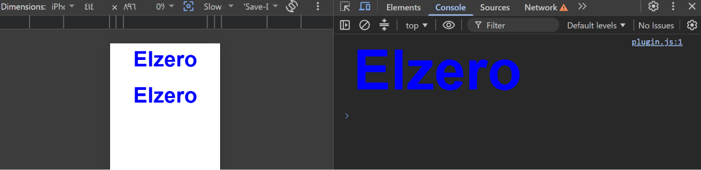

Task 2 — JavaScript Styling

A simple JavaScript task demonstrating 3 ways to style and display "Elzero":

- "console.log()" with "%c"
- "document.write()"
- "document.createElement()"

---

Preview

  

---

 Concepts

"%c" • "document.write()" • "createElement()" • DOM • CSS Styling

---

  <b> Built with JavaScript • Styled with CSS • Keep Learning & Building ✨</b>

