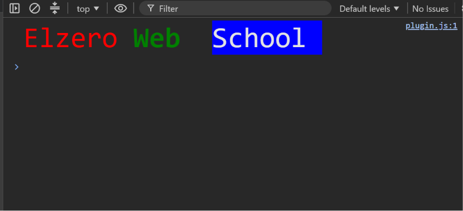

Task 3 — Console Styling

  

  A JavaScript task demonstrating the <b>%c</b> CSS directive 
  to style different parts of a message inside the browser console.

Preview

  

Concepts

"console.log()" • "%c" CSS Directive • CSS Styling • Console Output

  

  <i>JavaScript → Console → Styling</i>

