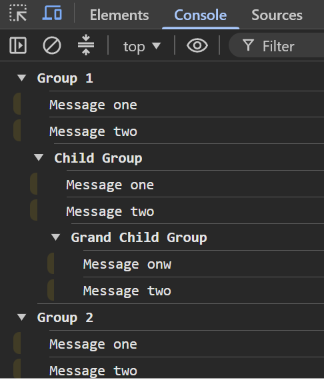

Task 4 — Console Groups

  

  A JavaScript task demonstrating <b>console.group()</b> and 
  nested console groups inside the browser console.

Preview

  

Concepts

"console.group()" • "console.groupEnd()" • Nested Groups • "console.log()"

  

  <i>JavaScript → Console → Groups → Nested Groups</i>

