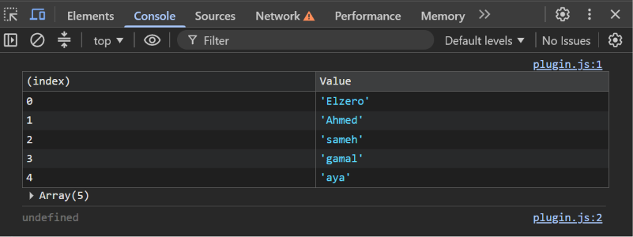

Task 5 — Console Table

  

  A JavaScript task demonstrating <b>console.table()</b> to display 
  an array of values in a structured table inside the browser console.

Preview

  

Concepts

"console.table()" • Arrays • "console.log()" • Console Output

  

  <i>JavaScript → Arrays → Console → Table</i>

