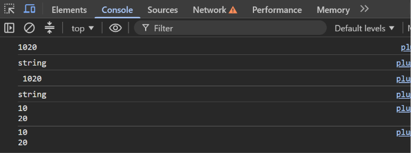

Task 1 — Concatenation & Template Literals

  

  A JavaScript task demonstrating <b>String Concatenation</b> and 
  <b>Template Literals</b> to produce the required output.

Preview

  

Concepts

"String Concatenation" • "Template Literals" • "typeof" • "\n" • JavaScript

  

  <i>JavaScript → Strings → Concatenation → Template Literals</i>

