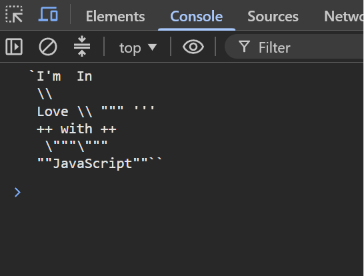

Task 3 — Escape Sequences

  

  A JavaScript task demonstrating <b>escape sequences</b> and 
  special characters inside strings.

Preview

  

Concepts

"console.log()" • Escape Sequences • Strings • "\n" • "\\" • Quotes

  

  <i>JavaScript → Strings → Escape Characters → Output</i>

