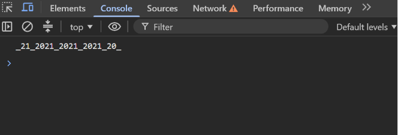

Task 4 — Template Literals & Repetition

  

  A JavaScript task demonstrating how to use <b>Template Literals</b> 
  and variables to create the required output without repeating the original variables.

Preview

  

Concepts

"Template Literals" • Variables • String Concatenation • Repetition

  

  <i>JavaScript → Variables → Template Literals → Output</i>

